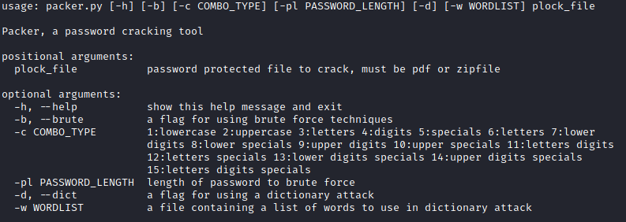
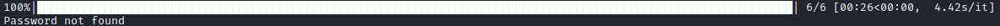

# Password Cracker

> **If at first you don't succeed, try, try, try again.**

---

### Table of Contents

- [Description](#description)
- [How To Use](#how-to-use)
- [References](#references)
- [License](#license)
- [Author Info](#author-info)

---

## Description

This is a simple command-line program that lets the user utilize different forms of password cracking techniques in
order to gian access to password-protected files and folders. I created this knowledge to better my skills in python and
to better understand the importance of security. This Tool was designed for learning purposes only.

#### Technologies

- Python
- PyCharm
- Markdown
- Pipenv
- GitHub

[Back To The Top](#Password Cracker)

---

## How To Use

#### Installation

Clone repository
`$ git clone https://github.com/USERNAME/REPOSITORY`

Unpack the contents of the repository into a directory and run pipenv install (no package names needed). Pipenv will
read the Pipfile and Pipfile.lock files for the project, create the virtual environment, and install all of the
dependencies as needed.

Inside Project folder run
`pipenv shell`

Run script
`pipenv run python3 packer.py -h`

#### Usage

> **Help Display**

> **Outcome Display**

---

## References

- Wikipedia - [Password Cracking](https://en.wikipedia.org/wiki/Password_cracking)
- Guru99 - [How2](https://www.guru99.com/how-to-crack-password-of-an-application.html)

[Back To The Top](#Password Cracker)

---

## License

MIT License

[Back To The Top](#Password Cracker)

---

## Author Info

- GitHub - [KyReid](https://github.com/kyReid)

[Back To The Top](#Password Cracker)
